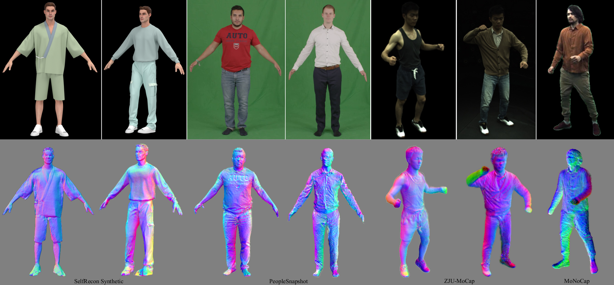
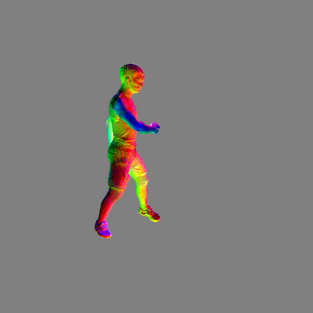
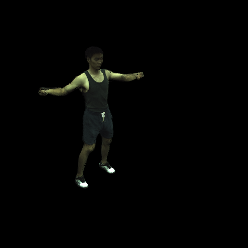
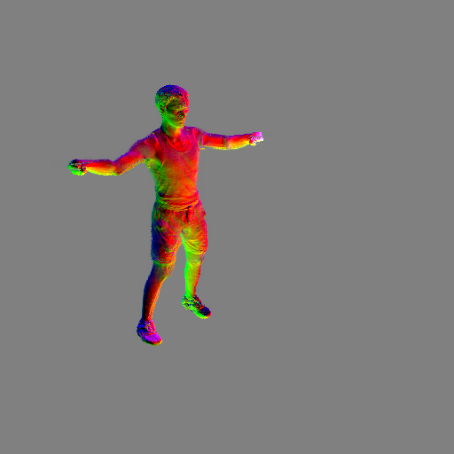

# PGAHum: Prior-Guided Geometry and Appearance Learning for High-Fidelity Animatable Human Reconstruction

## [Paper](https://arxiv.org/pdf/2404.13862) | [Project Page](https://whao22.github.io/PGAHum)

<div align="center">
   
  <!--  
   
   -->
</div>

<div>
  <!-- <text> <b>PGAHum: Prior-Guided Geometry and Appearance Learning for High-Fidelity Animatable Human Reconstruction</b> </text> <br> -->
  <!-- <text style="font-style:italic;"> Hao Wang, Qingshan Xu, Hongyuan Chen, Rui Ma </text> -->
  <!-- <br> -->
  This repository contains the implementation of our paper <a href="https://arxiv.org/pdf/2404.13862">PGAHum: Prior-Guided Geometry and Appearance Learning for High-Fidelity Animatable Human Reconstruction</a>.

  <!-- This repository contains the implementation of our paper [PGAHum: Prior-Guided Geometry and Appearance Learning for High-Fidelity Animatable Human Reconstruction](https://arxiv.org/pdf/2404.13862). -->


</div>

## Description

Recent techniques on implicit geometry representation learning and neural rendering have shown promising results for 3D clothed human reconstruction from sparse video inputs.
However, it is still challenging to reconstruct detailed surface geometry and even more difficult to synthesize photorealistic novel views with animatated human poses.
In this work, we introduce PGAHum, a prior-guided geometry and appearance learning framework for high-fidelity animatable human reconstruction.
We thoroughly exploit 3D human priors in three key modules of PGAHum to achieve high-quality geometry reconstruction with intricate details and photorealistic view synthesis on unseen poses.
First, a prior-based implicit geometry representation of 3D human, which contains a delta SDF predicted by a tri-plane network and a base SDF derived from the prior SMPL model, is proposed to model the surface details and the body shape in a disentangled manner.
Second, we introduce a novel prior-guided sampling strategy that fully leverages the prior information of the human pose and body to sample the query points within or near the body surface.
By avoiding unnecessary learning in the empty 3D space, the neural rendering can recover more appearance details.
Last, we propose a novel iterative backward deformation strategy to progressively find the correspondence for the query point in observation space.
A skinning weights prediction model is learned based on the prior provided by the SMPL model to achieve the iterative backward LBS deformation.
Extensive quantitative and qualitative comparisons on various datasets are conducted and the results demonstrate the superiority of our framework. Ablation studies also verify the effectiveness of each scheme for geometry and appearance learning.

## Usage

### Installation

Please run the following scripts for create python virtual environment and install the dependencies.

```
conda env create -f environment.yml
conda activate pgahum
bash scripts/install.sh
```

### SMPL Setup

Download `SMPL v1.0 for Python 2.7` from [SMPL website](https://smpl.is.tue.mpg.de/) (for male and female models), and `SMPLIFY_CODE_V2.ZIP` from [SMPLify website](https://smplify.is.tue.mpg.de/) (for the neutral model). After downloading, inside `SMPL_python_v.1.0.0.zip`, male and female models are `smpl/models/basicmodel_m_lbs_10_207_0_v1.0.0.pkl` and `smpl/models/basicModel_f_lbs_10_207_0_v1.0.0.pkl`, respectively. Inside `mpips_smplify_public_v2.zip`, the neutral model is `smplify_public/code/models/basicModel_neutral_lbs_10_207_0_v1.0.0.pkl`. Remove the chumpy objects in these .pkl models using [this code](https://github.com/vchoutas/smplx/tree/master/tools) under a Python 2 environment (you can create such an environment with conda). Finally, rename the newly generated .pkl files and copy them to subdirectories under `./data/body_models/smpl/`. Eventually, the `./data/body_models` folder should have the following structure:

```
data/body_models
 └-- smpl
    ├-- male
    |   └-- model.pkl
    ├-- female
    |   └-- model.pkl
    └-- neutral
        └-- model.pkl
```

Then, run the following script to extract necessary SMPL parameters used in our code:

```
python extract_smpl_parameters.py
```

The extracted SMPL parameters will be saved into `./body_models/misc/`.

### Data Preparation

You can get the raw data from their respective sources and use our preprocessing script to generate data that is suitable for our training/validation scripts. Please follow the steps in [DATASET.md](https://github.com/taconite/arah-release/blob/main/DATASET.md). Train/val splits on cameras/poses follow [NeuralBody&#39;s split](https://github.com/zju3dv/neuralbody/blob/master/supplementary_material.md#training-and-test-data). Pseudo ground truths for geometry reconstruction on the ZJU-MoCap dataset are stored in [this folder](https://drive.google.com/drive/folders/1-OE3h7nxg7ixL3yh0Y7bGYKVsNWS-Zm4?usp=share_link). For evaluation script and data split of geometry reconstruction please refer to [this comment](https://github.com/taconite/arah-release/issues/9#issuecomment-1359209138).

For example, to preprocess the ZJU-MoCap dataset, run the following script:

```
python tools/prepare_zju_mocap/prepare_dataset.py --conf tools/prepare_zju_mocap/confs_preprocess/***.yaml
```

The preprocessed data will be saved into `[data/data_prepared/CoreView_***]`.

### Training

Please run the following script to train the model.

```
bash scripts/train_377_hfavatar.sh
```

### Inference

Please run the following script to validate and test.

```
bash scripts/infer_377_hfavatar.sh
```

For example, in script `run_377_hfavatar`, the term `exp_name` denoted the specified model which need to be used. resolution_level determined the level of the rendering images, `4 for (256, 256), 2 for (512, 512)`. The term `novel_view` represents a new view point for testing, which can be any one of the existing perspectives, such as any one between 0 and 22 in the context of ZJUMocap dataset. `novel_pose` specifies the directory for a new pose sequence. `infer_mode` indicates the mode of inference, and its value can be either `val` or `test`. The distinction lies in the fact that `val` involves comparison with GT images, while `test` does not. When a new pose is specified, please make sure to keep the `infer_mode=test`.

### Extract Geometry

You can run the following script to extract mesh from learned sdf function. The term `base_exp_dir` represents the model path, and `resolution` indicates the resolution of the grid for feature extraction.

```
python extract_geometry.py --conf [/path/to/conf] --base_exp_dir [/path/to/exp_dir] --resolution 512
```

## Citation

```
@article{wang24pgahum,
  author    = {Hao Wang and Qingshan Xu and Hongyuan Chen and Rui Ma},
  title     = {PGAHum: Prior-Guided Geometry and Appearance Learning for High-Fidelity Animatable Human Reconstruction},
  journal   = {arXiv preprint arXiv:2404.13862},
  year      = {2024}
}
```

## License

Distributed under the GPL License. See `LICENSE` for more information.

## Acknowledgements

This project is built on [ARAH](https://github.com/taconite/arah-release), [HumanNeRF](https://github.com/chungyiweng/humannerf), [Pet-NeuS](https://github.com/yiqun-wang/PET-NeuS), and others. We thank all of them for their contributions.