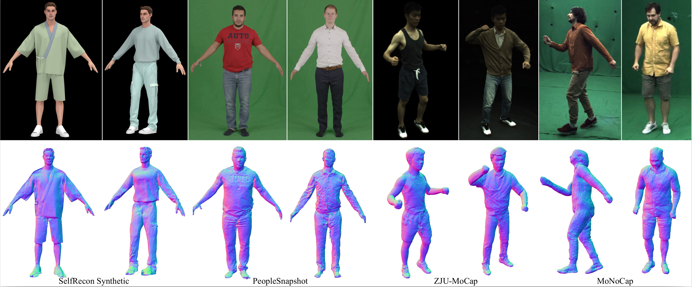

# HF-Avatar: Learning High-Fidelity Animatable Avatar with Fine Geometric Details from Videos

## Description


<div align="center">
   
  <!--  
   
   -->
</div>

The digitization of the human body will be crucial for  future gaming, movies, mixed reality, remote interaction, and the ``metaverse''. Recent methods have shown that 3D human avatar can be reconstructed from videos, making the 3D human avatar acquisition more convenient and flexible. Although existing methods can synthesize photorealistic novel viewpoint images, most of them lack explicit constraints on the underlying geometry, resulting in mostly subpar human geometry models.
In this work, we introduce HF-Avatar to reconstruct high-fidelity animatable avatar with fine geometric details from videos, allowing for both high-quality geometry reconstruction with intricate details and photorealistic view synthesis on unseen poses. 
Specifically, we propose a hybrid explicit and implicit representation schema for human body. It effectively combines the advantages of explicit representation of spatiotemporal consistency and implicit representation of topological structural freedom, enabling our network to focus on learning detailed structures of clothed humans without excessive effort on the entire body. Furthermore, a novel prior-guided inner sampling strategy is introduced. It fully leverages prior human pose and shape information to cover various parts of the human body and avoid unnecessary sampling in empty 3D space, which enhances the efficiency of volume rendering on detail structures. Besides, we propose an iterative backward deformation strategy. It accurately warps points in observation space to canonical space in a progressive manner. This provides precise detail appearance information to supervise our fine geometry learning. Moreover, it facilitates our generalization on unseen poses. With the help of the three modules, we can reconstruct a high fidelity geometry with fine details from videos. Experiments on different datasets show that compared to state-of-the-art methods, our approach exhibits good performance.

## Usage

### Installation

Please run the following scripts for create python virtual environment and install the dependencies.

```
conda env create -f environment.yml
conda activate hf-avatar
bash scripts/install.sh
```

### SMPL Setup

Download `SMPL v1.0 for Python 2.7` from [SMPL website](https://smpl.is.tue.mpg.de/) (for male and female models), and `SMPLIFY_CODE_V2.ZIP` from [SMPLify website](https://smplify.is.tue.mpg.de/) (for the neutral model). After downloading, inside `SMPL_python_v.1.0.0.zip`, male and female models are `smpl/models/basicmodel_m_lbs_10_207_0_v1.0.0.pkl` and `smpl/models/basicModel_f_lbs_10_207_0_v1.0.0.pkl`, respectively. Inside `mpips_smplify_public_v2.zip`, the neutral model is `smplify_public/code/models/basicModel_neutral_lbs_10_207_0_v1.0.0.pkl`. Remove the chumpy objects in these .pkl models using [this code](https://github.com/vchoutas/smplx/tree/master/tools) under a Python 2 environment (you can create such an environment with conda). Finally, rename the newly generated .pkl files and copy them to subdirectories under `./data/body_models/smpl/`. Eventually, the `./data/body_models` folder should have the following structure:

```
data/body_models
 └-- smpl
    ├-- male
    |   └-- model.pkl
    ├-- female
    |   └-- model.pkl
    └-- neutral
        └-- model.pkl

```

Then, run the following script to extract necessary SMPL parameters used in our code:

```
python extract_smpl_parameters.py
```

The extracted SMPL parameters will be saved into `./body_models/misc/`.

### Data Preparation

You can get the raw data from their respective sources and use our preprocessing script to generate data that is suitable for our training/validation scripts. Please follow the steps in [DATASET.md](https://github.com/taconite/arah-release/blob/main/DATASET.md). Train/val splits on cameras/poses follow [NeuralBody&#39;s split](https://github.com/zju3dv/neuralbody/blob/master/supplementary_material.md#training-and-test-data). Pseudo ground truths for geometry reconstruction on the ZJU-MoCap dataset are stored in [this folder](https://drive.google.com/drive/folders/1-OE3h7nxg7ixL3yh0Y7bGYKVsNWS-Zm4?usp=share_link). For evaluation script and data split of geometry reconstruction please refer to [this comment](https://github.com/taconite/arah-release/issues/9#issuecomment-1359209138).

For example, to preprocess the ZJU-MoCap dataset, run the following script:

```
python tools/prepare_zju_mocap/prepare_dataset.py --conf tools/prepare_zju_mocap/confs_preprocess/***.yaml
```

The preprocessed data will be saved into `[data/data_prepared/CoreView_***]`.

### Training

Please run the following script to train the model.

```
bash scripts/train_377_hfavatar.sh
```

### Inference

Please run the following script to validate and test.

```
bash scripts/infer_377_hfavatar.sh
```

For example, in script `run_377_hfavatar`, the term `exp_name` denoted the specified model which need to be used. resolution_level determined the level of the rendering images, `4 for (256, 256), 2 for (512, 512)`. The term `novel_view` represents a new view point for testing, which can be any one of the existing perspectives, such as any one between 0 and 22 in the context of ZJUMocap dataset. `novel_pose` specifies the directory for a new pose sequence. `infer_mode` indicates the mode of inference, and its value can be either `val` or `test`. The distinction lies in the fact that `val` involves comparison with GT images, while `test` does not. When a new pose is specified, please make sure to keep the `infer_mode=test`.

## Extract Geometry

You can run the following script to extract mesh from learned sdf function. The term `base_exp_dir` represents the model path, and `resolution` indicates the resolution of the grid for feature extraction.

```
python extract_geometry.py --conf [/path/to/conf] --base_exp_dir [/path/to/exp_dir] --resolution 512
```

## Citation

```
@article{wang2023b,
  title={TITLE},
  author={AUTHOR},
  journal={JOURNAL},
  year={YEAR}
}
```

## License

Distributed under the GPL License. See `LICENSE` for more information.

## Acknowledgements

This project is built on [ARAH](https://github.com/taconite/arah-release) and [HumanNeRF](https://github.com/chungyiweng/humannerf), thank them for their contributions.
